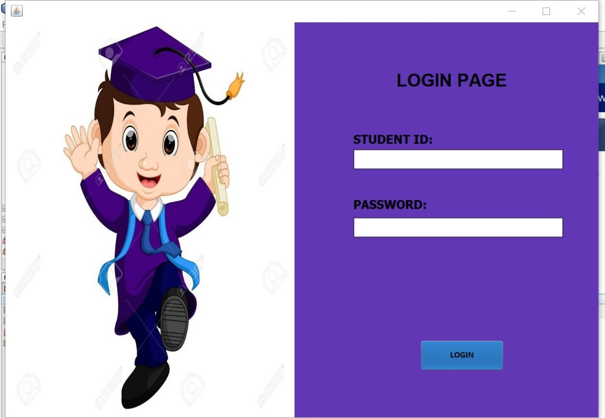
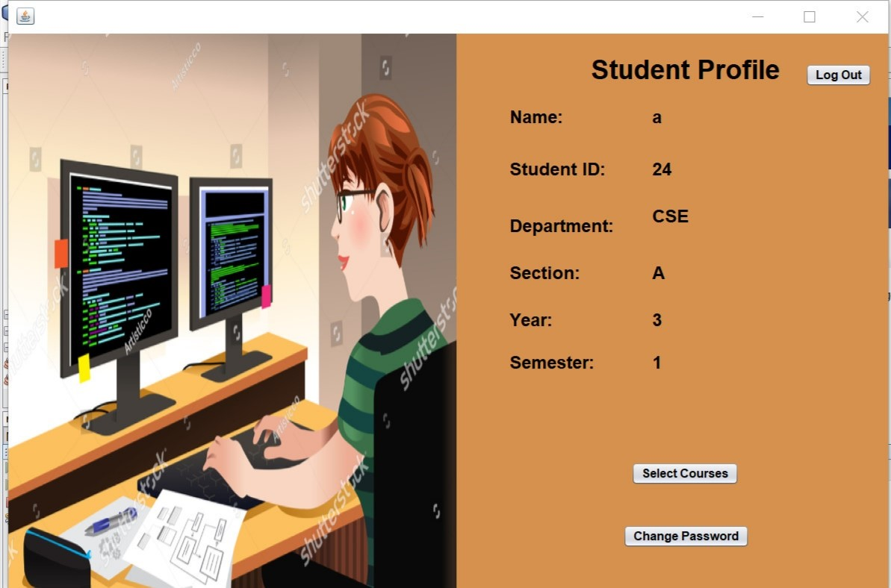
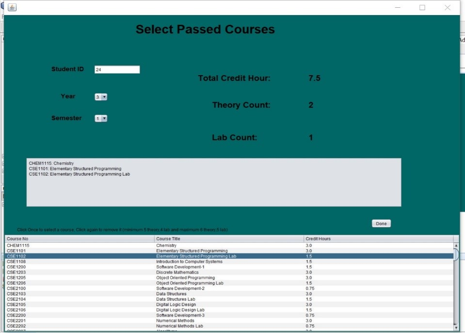
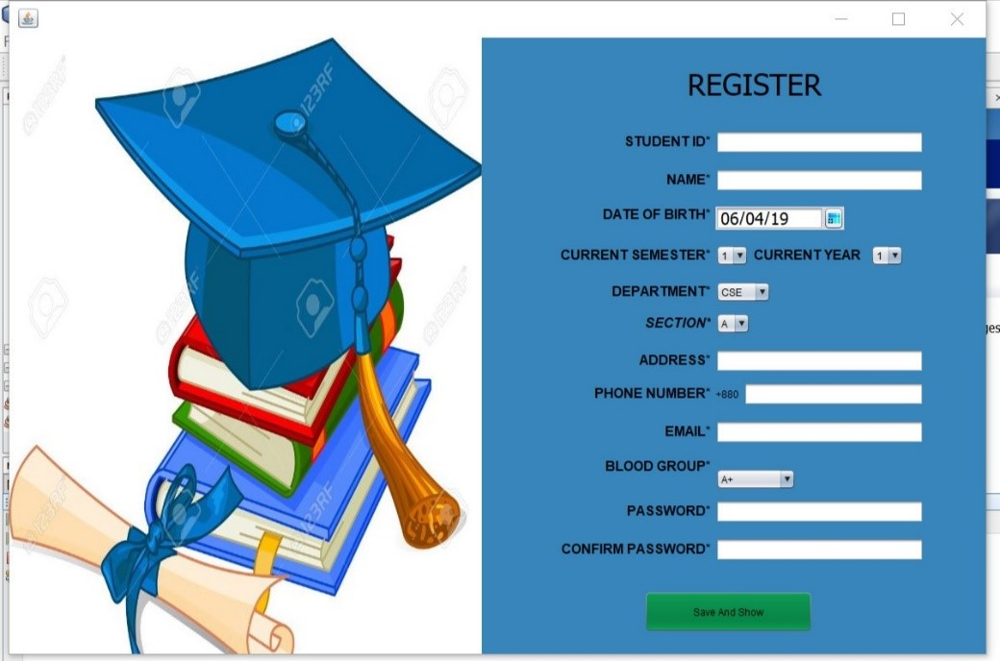

# Open Credit System
### 3rd year 1st semester's Database Project 
It is a database software which is capable of keeping records of students' course information, their grades, and which courses they could avail in the current semester they are in.

Language: Java, SQL Server

Tasks that can be performed by this app are:
* Home page  

* Login page  

* Profile page  

* Admin page  

* Registration page  

* Change Password page  

* Course Selection page  

