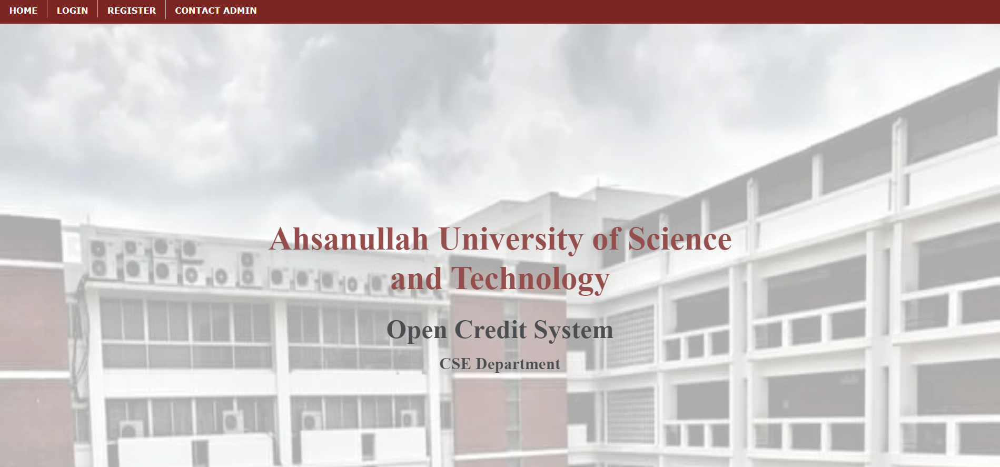
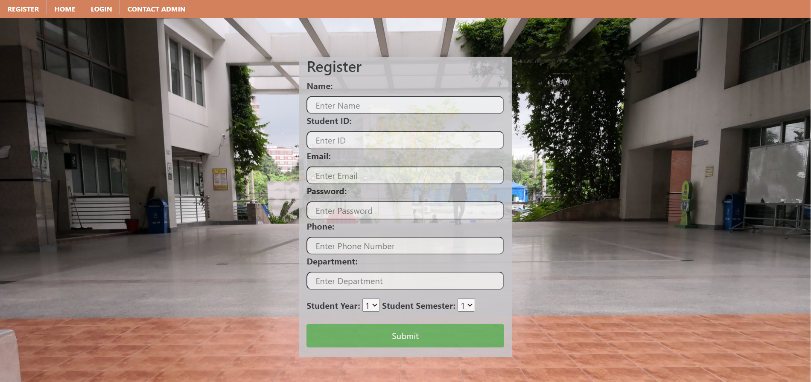
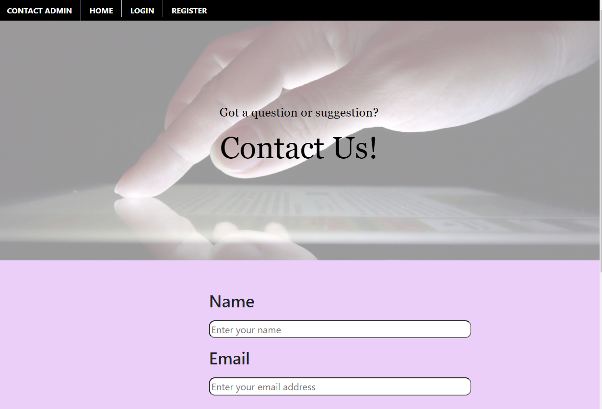

# Open Credit System
### 3rd year 1st semester's Database Project 
It is a bootstrap website which is capable of keeping records of students' course information, their grades, and which courses they could avail in the current semester they are in.

Language: PHP, Bootstrap, HTML

Tasks that can be performed by this app are:

* Home page  

* Login page  

* Register page  

* Contact Admin page  

